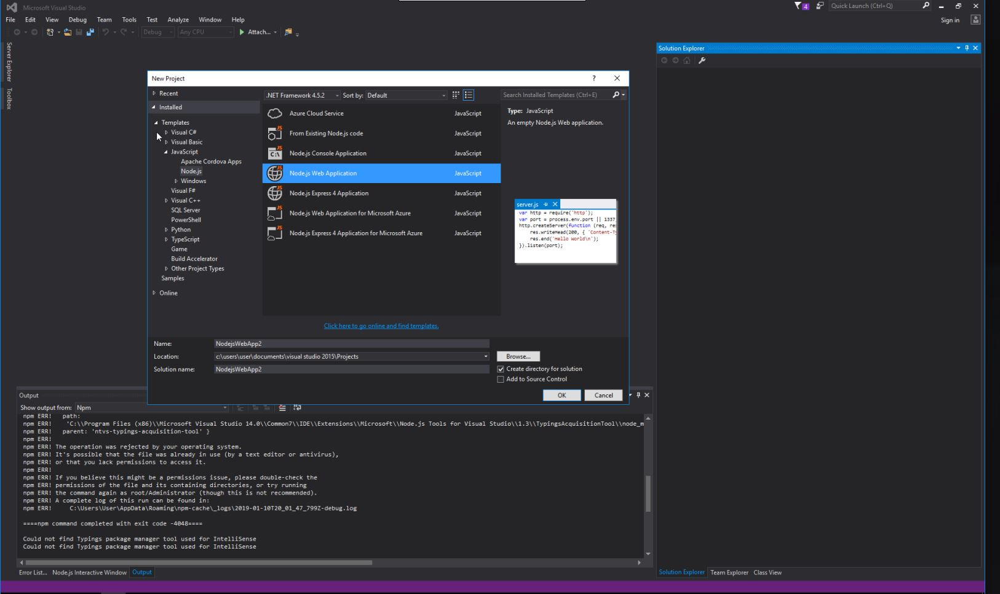
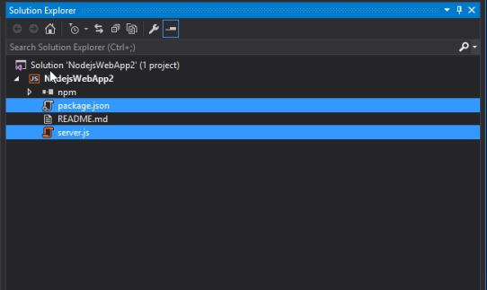
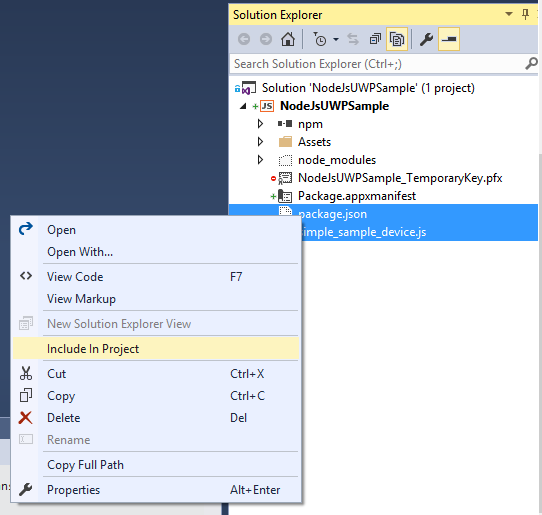
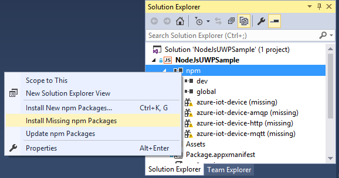
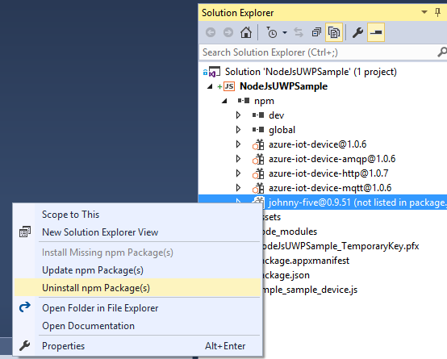
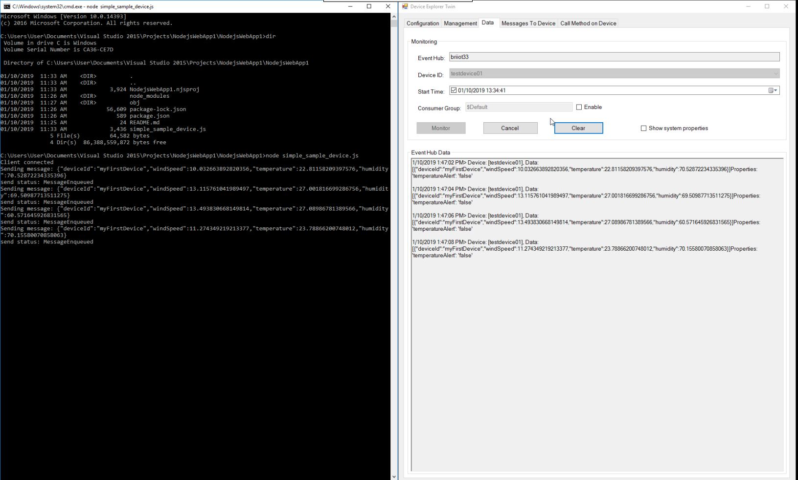

Run a simple NodeJS sample on B&R APC device running Windows 10
===
---

-   [Introduction](#Introduction)
-   [Step 1: Sign Up To Azure IoT Hub](#Step_1:_Sign_Up)
-   [Step 2: Register Device](#Step_2:_Register)
-   [Step 3: Build and Validate the Sample using NodeJS Client Libraries](#Step_3:_Build_and_Validate)
    -   [3.1 Connect the Device](#Step_3_1:_Connect)
    -   [3.2 Build the Samples](#Step_3_2:_Build)
    -   [3.3 Run and Validate the Samples](#Step_3_3:_Run)
-   [Step 4: Troubleshooting](#Step_5:_Troubleshooting)

# Introduction

**About this document**

This multi-step process includes:
-   Configuring Azure IoT Hub 
-   Registering your IoT device
-   Build and deploy Azure IoT SDK on device
-   Packaging and sharing the logs  

**Prepare**

Before executing any of the steps below, read through each process, step
by step to ensure end to end understanding.

You should have the following items ready before beginning the process:

-   Computer with **Windows 10** having Git client installed and access to the [azure-iot-sdk-node](https://github.com/Azure/azure-iot-sdk-node) GitHub public repository.
-   Install Visual Studio 2015 and Tools. You can install any edition of Visual Studio, including the free Community edition.

    Make sure to select the "Universal Windows App Development Tools", the component required for writing apps Windows 10:
    
    
- Install the latest Node.js Tools for Visual Studio from [here](<https://www.visualstudio.com/features/node-js-vs>) 
-   Install the latest Node.js Tools for Windows IoT from [here](<https://github.com/ms-iot/ntvsiot/releases/tag/v1.5.1>) 

-   Required hardware running Windows 10 IoT Core to certify.

     ***Note:*** *If you need assistance installing Windows 10 IoT Core , please visit <https://www.windowsondevices.com> or contact us at <iotcert@microsoft.com>*

# Step 1: Sign Up To Azure IoT Hub

Follow the instructions [here](https://account.windowsazure.com/signup?offer=ms-azr-0044p) on how to sign up to the Azure IoT Hub service.

As part of the sign up process, you will receive the connection string.

-   **IoT Hub Connection String**: An example of IoT Hub Connection String is as below:

        HostName=[YourIoTHubName];SharedAccessKeyName=[YourAccessKeyName];SharedAccessKey=[YourAccessKey]

# Step 2: Register Device

-   Follow the instructions [here](<https://github.com/Azure/azure-iot-device-ecosystem/blob/master/manage_iot_hub.md>) on how to provision your device and get its credentials.

# Step 3: Build and Validate the Sample using Node.js Client Libraries 

This section walks you through the steps to create a UWP Node.js wrapper over existing Node.js client SDK using Visual Studio. Once done, you will build and deploy the IoT Client SDK, and validate the sample tests required for IoT certification with the Azure IoT SDK.

## 3.1 Connect the Device

1.  Connect the board to your network using an Ethernet cable. This step
    is required, as the sample depends on internet access.

2.  Power the board using a micro-USB cable or power adapter.

## 3.2  Build the Samples

1.  Start a new instance of Visual Studio 2015.

2. Create a new project (**File | New Project…**). In the New Project dialog, navigate to Node.js as shown below (in the left pane in the dialog: Templates | JavaScript | Node.js). Select the **Node.js template** (shown below). Enter a name for your project, for example **NodeJsUWPSample**. 

    

3. Select app.js and package.json file in Solution Explorer, Right click and select **Delete**.

      
          
4. Clone [Azure IoT SDK](https://github.com/Azure/azure-iot-sdk-node.git) repository to your Windows 10 machine. 

5. In File explorer, Copy **package.json** and **simple_sample_device.js** files available under Node.js sample of the repository on your machine. For example if you cloned the **azure-iot-sdk-node** repository under C:\IOT directory, Go to **(C:\azure-iot-sdk-node\device\samples\)**

          
6. Go back to Visual Studio, Right click your project in Solution Explorer and click **Open Folder in File Explorer**.
   
7. Paste the files you copied earlier in this folder.
    
8. Go back to Visual Studio, in Solution Explorer on the top context menu, click **Show All Files**.
    
9. (Optional for some Visual Studio) Right click both **package.json** and **simple_sample_device.js** files and choose **Include in project** option.

      
        
10. Right click the **npm** node and click **Install Missing npm Packages** to install the required packages for the solution.

    
    
11. Expand the npm node in Solution Explorer and right click all package(s) that shows not listed in package and click **Uninstall npm Package(s)**.

    

12.  Select **simple_sample_device.js** file and locate the following code in the **simple_sample_device.js** file:

        var connectionString = '[IoT device connection string]';

13.  Replace `[IoT device connection string]` with the connection string for your device and **Save** the changes. You can get the connection string from DeviceExplorer as explained in [Step 2](#Step_2:_Register).

14. Right click the **simple_sample_device.js** file and from context menu choose "Set as Node.JS Startup File".

15.  Choose the right architecture (x86 or ARM, depending on your device) and set the debugging method to "Remote Machine", or local machine.
    
16.  To deploy the binaries on your device, right-click on the NodeJsUWPSample project in the **Solution Explorer**, select **Properties** and navigate to the **General** tab:

     

   Type in the name or IP of your device.

17.  Build the solution.

## 3.3 Run and Validate the Samples
    
In this section you will run the Azure IoT client SDK samples to validate the
communication between your device and Azure IoT Hub. You will send the messages to the Azure IoT Hub service and validate that IoT Hub has successfully receive the data. You will also monitor any messages sent from the Azure IoT Hub to client.

***Note:*** *Take screenshots of all the operations you will perform in this
section. These will be needed in [Step 4](#Step_4_2:_Share).*

### 3.3.1 Send Device Events to IoT Hub

1.  Launch the DeviceExplorer as explained in [Step 2](#Step_2:_Register) and navigate to **Data** tab. Select the device name you created from the drop-down list of device IDs and click **Monitor** button.

    

2.  DeviceExplorer is now monitoring data sent from the selected device to the IoT Hub.
     

3.  In Visual Studio, from **Solution Explorer**, right-click the **NodeJsUWPSample** project, click **Debug &minus;&gt; Start new instance** to build and run the sample. 

       
4. You should be able to see the events received in the DeviceExplorer's data tab.

      

### 3.3.2 Receive messages from IoT Hub

1.  To verify that you can send messages from the IoT Hub to your device, go to the **Messages to Device** tab in DeviceExplorer.

2.  Select the device you created using Device ID drop down.

3.  Add some text to the Message field, then click Send.

    

4.  You should be able to see the message received in the Visual Studio Output window.
  

   

# Step 4: Troubleshooting

Please contact engineering support on <support@br-automation.com> for help with troubleshooting.
